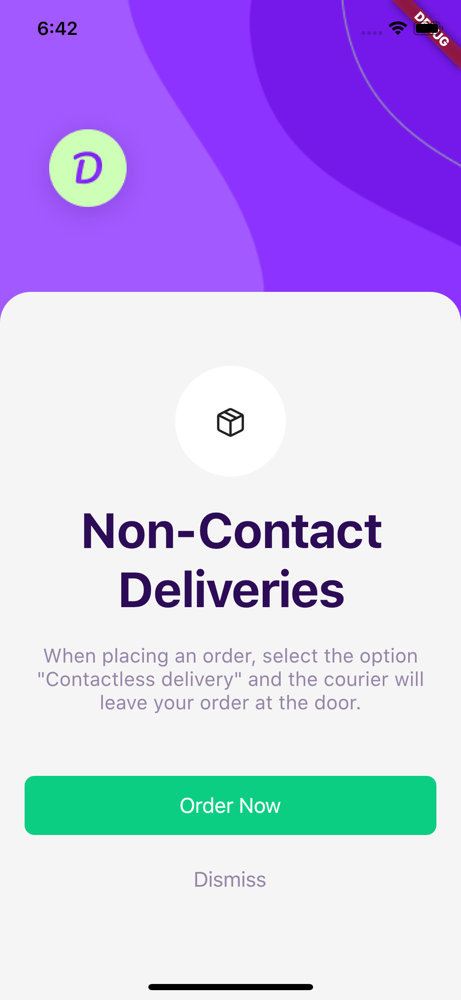
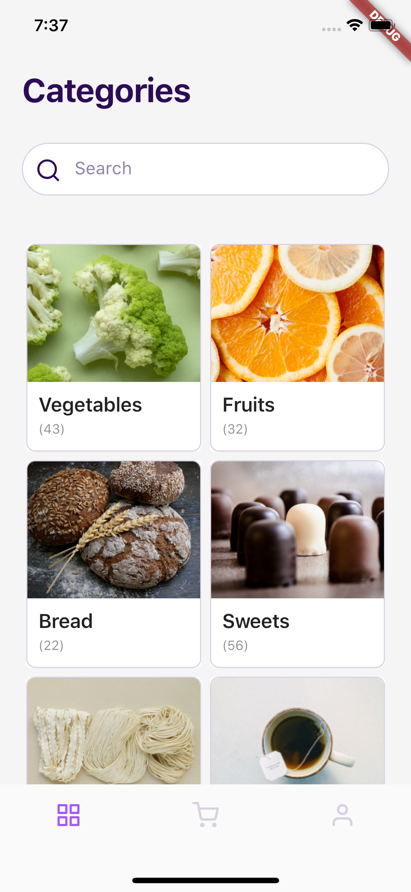

<h1 align="center">
    Flutter Delivery App UI
</h1>

  <a href="#zap-getting-started">Getting Started</a>&nbsp;&nbsp;&nbsp;|&nbsp;&nbsp;&nbsp;
  <a href="#-screenshots">Screenshots</a>&nbsp;&nbsp;&nbsp;|&nbsp;&nbsp;&nbsp;
  <a href="#-project">Project</a>&nbsp;&nbsp;&nbsp;|&nbsp;&nbsp;&nbsp;
  <a href="#ok_man-author">Author</a>&nbsp;&nbsp;&nbsp;|&nbsp;&nbsp;&nbsp;
  <a href="#memo-license">License</a>

This is a simple delivery app UI written in Flutter, based on [Free UI Kit | Delivery App](https://dribbble.com/shots/10828360-Free-UI-Kit-Delivery-App).

## :zap: Getting started

Make sure you have correctly installed Flutter and Android SDK, or iOS SDK if you are on macOS. Then just execute `flutter run`.

## 📸 Screenshots

  
  

## 💻 Project

This project was built for improving my skills with Flutter UI. You can watch me coding this project in my [Speed Code video](https://www.youtube.com/watch?v=XOzd-MjcPNY).

The only external package used in this project is Flutter Icons, because I use Feather Icons in the app.

## :ok_man: Author
| |
|:---------------------:|
|  [Bruno Lombardi](https://github.com/bruno-lombardi)   |

## :memo: License

This project is under license MIT. See [LICENSE](LICENSE.md) for more details.
